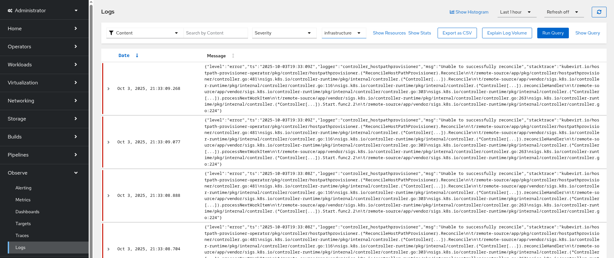
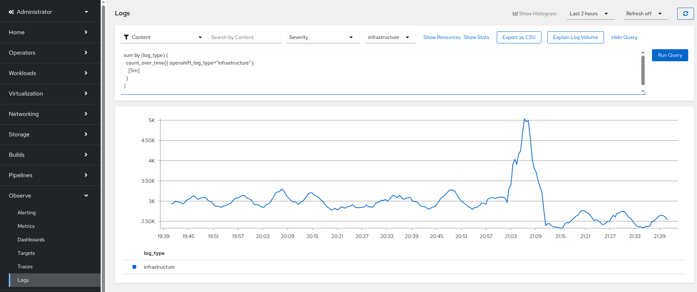
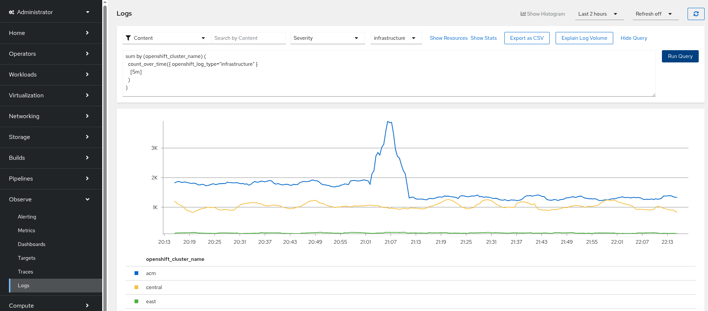

# OpenShift Logging through OTLP to LokiStack with queuing capability

As already proofen in the previous [Blog](https://www.linkedin.com/pulse/opentelemetry-collector-otel-queuing-stage-openshift-logging-lang-hmyaf/?trackingId=7hYpYuRko9iTiiRR52DozQ%3D%3D) we already know that OpenTelemetry can safe us from loosing logs. 
With the most recent version of Red Hat Build of OpenTelemetry (RHBOT) I started the journey once more with the goal to have every component RH supported (even if some are only Technology Preview (TP) state) as well as using Cluster Observability Operator (COO) and the provided plugin to provide Log access in the OpenShift UI.

Side goal, federating multiple clusters into one Logging stack with the simple addition of an exporter targetting the centralized OpenTelemetry Collector (otc) to only have one COO UIPlugin for Logs deployed.

A lot of buzz words and things but I will guide you through the process.

## Requirements or Lab setup 

* OpenShift v4.16+ (works on 4.16 and above until OpenShift Cluster-Logging moves to version 6.4 which is 4.19)
* S3 Bucket, I didn't want to impose an OpenShift DataFoundation (ODF) setup into that lab so pick which ever S3 bucket you can get
* Cluster Administrative permissions since we are going to install Operators and need some ClusterRole bindings for some of them

## deploying the necessary Operators

We first focus on the necessary operators in the "centralized" Cluster (the one providing the COO logging plugin).

### Deploying the Loki Operator 

to create the necessary namespace, operator group and subscription, execute following command

```
oc create -f loki-operator.yml
```

### Deploying the OpenShift Cluster logging Operator

to create the necessary namespace, operator group and subscription, execute following command

```
oc create -f openshift-logging-operator.yml
```

### Deploying the Red Hat Build of OpenTelemetry Operator

to create the necessary namespace, operator group and subscription, execute following command

```
oc create -f opentelemetry-operator.yml
```

### Deploying the Cluster Observability Operator 

to create the necessary namespace, operator group and subscription, execute following command

```
oc create -f openshift-cluster-observability-operator.yml
```

## Configuring all components

I am using the "all components" section in particular to ensure ordering is happening as expected since we do not use any GitOps Controller like OpenShift GitOps where we could use "sync-waves".

### Configure the S3 Bucket credentials for the LokiStack

ensure to adjust the parameters in the file `lokistack-s3-secret.yml`. Remember that the values are base64 encoded.

Configure the following values:

* access_key_id equals the AWS_ACCESS_KEY_ID
* access_key_secret equals the AWS_SECRET_ACCESS_KEY
* bucketnames shall be the bucket you have available 
* endpoint equals AWS_ENDPOINT_URL
* forcepathstyle shall not be modified and is set to true
* region can be omitted if you are using `us-east-1` 

to create the S3 bucket secret, execute following command

```
oc create -f lokistack-s3-secret.yml
```

### Configure the LokiStack instance 

ensure to adjust the `storageClassName` in the file `lokistack.yml` which is set to "hostpath-csi" for demo purpose.
The LokiStack is configured for demo purpose and uses the T-shirt size `1x.demo` 

to create the LokiStack, execute following command

```
oc create -f lokistack.yml
```

### Configure the OpenTelemetry collector 

the otc will be used to received logs from clf and forward them into the LokiStack
ensure to adjust the `storageClassName` in the file `opentelemetry-collector.yml` which is set to "hostpath-csi" for demo purpose and is necessary to show queuing capabilities in case of an outage of the LokiStack.
furter note, it's also mandatory to have the LokiStack deployed first as the otc requires the mTLS configuration for the Loki distributor to successfully forward logs.

to create the otc, execute following command

```
oc create -f opentelemetry-collector.yml
```

### Configure the OpenShift Cluster logging forwarder

The OpenShift Cluster logging forward (clf) is responsible to collect all logs and therefor requires ClusterRoleBindings to the Serviceaccount chosen.

to create the serviceaccount `clfotlp`, execute following command

```
oc create -f serviceaccount-cluster-logging.yml
```

to grant the necessary roles to the serviceaccount, execute following command

```
oc create -f openshift-logging-rbac.yml
```

for simplicity the RBAC includes all three (infrastructure,application,audit) categories eventhough the demo will focus on just one (infrastructure).
to handle all three categories on the same otc you would need to add routing capability on the otc according to attribute matching of the records received which I dropped for the demo purpose. (ping me if you need help on that)

to create the clf, execute following command

```
oc create -f clf.yml
```

### Configure the COO logging plugin

with the stack up and running we are missing only one item which is `visualization`.

to create the OpenShift UI observability for logs, execute following command

```
oc create -f coo-logging-uiplugin.yml
```

once the UI tell's you to refresh, the Observe Tab should have an entry for Logs.



## Disk based queuing to cover a LokiStack outage

As mentioned before, otc provides a simple way to queue logs in case of an backend storage (Loki) outage. I recorded for you a simulated outage and if you want to see it in your demo execute following command

```
watch -n1 oc -n openshift-logging scale --replicas=0 deployment.apps/lokistack-distributor
```

this command will constantly set the lokistack distributor to terminate without removing anything and still providing OpenShift UI access to logs already received.

Once you consider the outage "long enough", stop the command and execute 

```
oc -n openshift-logging scale --replicas=1 deployment.apps/lokistack-distributor
```

even though the Loki Operator should rescale the deployment automatically.

refresh the OpenShift UI log query you have been watching to see that the logs have been backfiled.

an example query to see the count_over_time can be

```
sum by (log_type) (
  count_over_time({ openshift_log_type="infrastructure" }
    [5m]
  )
)
```

the following show the logs during the outage test for this demo


## Federating multiple clusters into one LokiStack (NOTE unsupported !!!)

we all know that needing to move to logging console in cluster1 and than into cluster2 and and and is soo anoying. 
With otc we get the possibility to federate the logs into one LokiStack and as long as this Stack is capable to take the load we no longer need to move to different UI's.

!!! NOTE !!! even though this is technically possible, there is no support from Red Hat on that feature at the moment or planned. For federated Cluster Observability please evaluate Red Hat Advanced Cluster manager.


### Integrating foreing OpenShift Clusters into your LokiStack

Follow the steps from `deploying the necessary Operators`

* [Deploying the OpenShift Cluster logging Operator](#deploying-the-openshift-cluster-logging-operator)
* [Configure the OpenTelemetry collector](#deploying-the-loki-operator)
* [Configure the OpenShift Cluster logging forwarder](#configure-the-openshift-cluster-logging-forwarder)

Next ensure to expose the otc otlphttp endpoint on the centralized cluster for remote access by executing following command 

```
cat <<'EOF' | oc create -f -
apiVersion: route.openshift.io/v1
kind: Route
metadata:
  name: otel-collector
  namespace: openshift-logging
spec:
  host: otc-openshift-logging.apps.example.com
  port:
    targetPort: otlp-http
  tls:
    insecureEdgeTerminationPolicy: Redirect
    termination: edge
  to:
    kind: Service
    name: otel-collector
    weight: 100
  wildcardPolicy: None
EOF
```

Configure the OpenTelemetry Collector by replacing the `otlphttp/lokistack` exporter with 
the create route of the centralize collector and add certificates accordingly if needed

```
spec:
  config:
    exporters:
      otlphttp/logging:
        endpoint: https://otc-openshift-logging.apps.example.com
        tls:
          ca_file: /etc/certs/ca-trustbundle.pem

  volumeMounts:
    - mountPath: /etc/certs/
      name: mycustomca
  volumes:
    - configMap:
        items:
          - key: ca-trustbundle.pem
            path: ca-trustbundle.pem
        name: mycustomca
      name: mycustomca
```

the OpenShift UI will now be able to show logs from multiple clusters depending on the attributes you add/modify you can even select them based upon your custom assigned cluster name if you want by adding transformation processors accordingly.

```
spec:
  config:
    processors
      transform/clustername:
        error_mode: ignore
        log_statements:
          - set(log.attributes["openshift_cluster_name"], "central") where resource.attributes["openshift.cluster_id"]
            == "xxxx-xx-xx-xx-xxxx"
          - set(log.attributes["openshift_cluster_name"], "east") where resource.attributes["openshift.cluster_id"]
            == "yyyy-yy-yy-yy-yyyy"
          - set(log.attributes["openshift_cluster_name"], "acm") where resource.attributes["openshift.cluster_id"]
            == "zzzz-zz-zz-zz-zzzz"
  service:
    pipelines:
      logs:
        processors:
          - transform/clustername
```


